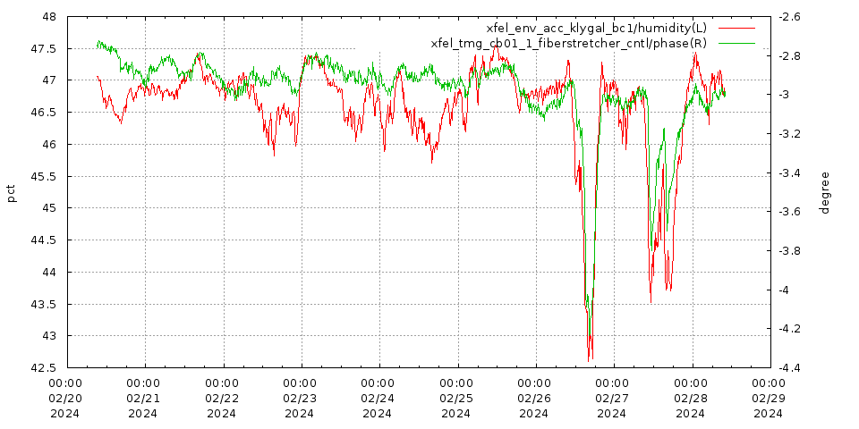
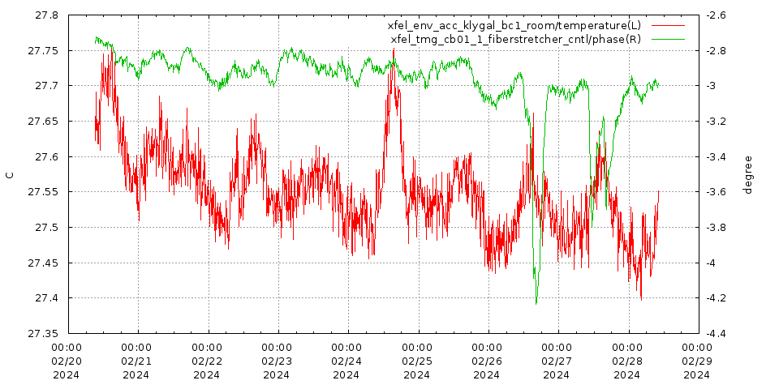
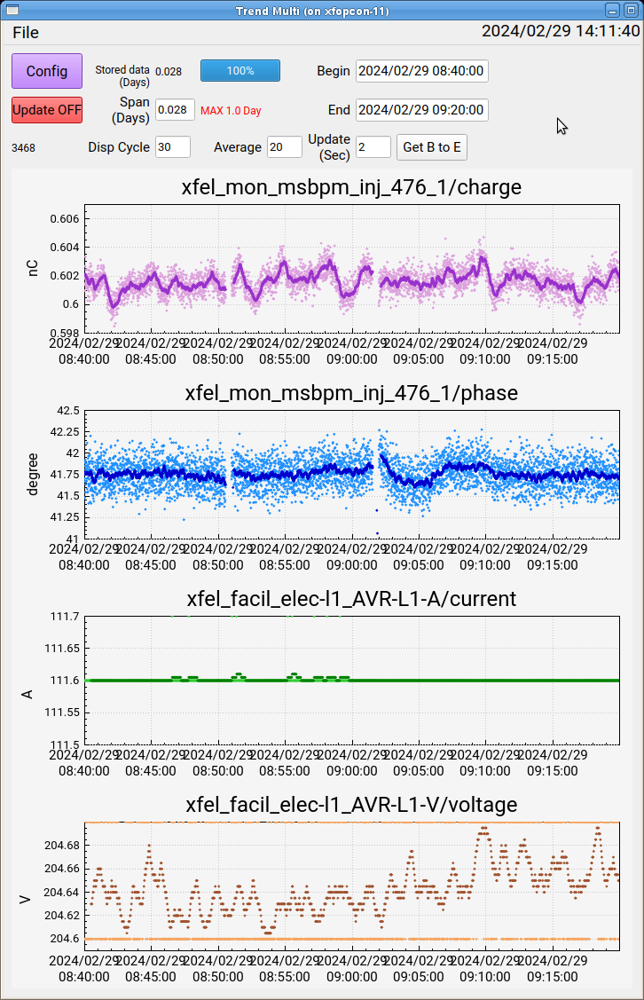

Hikitsugi202401
=============

[u運転メモ](https://www.dropbox.com/scl/fi/p7tnd9io267d786ckmwv0/u.xlsx?rlkey=hmdz01hffkgcqiwu53bhm5kzx&dl=0)  
[ログサーチ](http://saclaopr19.spring8.or.jp/~logsearch/)  

- [x] 1/15 キッカー電源予備機の不具合調整（tracking errorの解消）。キッカー電源予備機へのTDUからのトリガーを現状よりも200μs遅らせる必要があります。
   なおキッカー１号機のトリガー（TDU別チャンネル）は変更の必要はありません。
  キッカーは今 MS-2本番機！ 10Hz 入射＃13でよい！！！！  MS-0(予備機)は 10Hz 入射は XSBT 10Hz, BL2 50Hz のパターン（#21）

- [ ] 1/15 BL2 ID3_2_2 SIP-４のコネクタ交換
- [ ] 1/15 XSBT 偏向電磁石電源調査 プローブ設置
- [ ] 1/15 CB13-3 PFN 高電圧充電器 CABLES/FAN
- [x] 1/15 LH 1 光路長 PID がストレッチャー操作とは逆方向に検波位相が動く。パラメータ Kp の符号を逆にすると安定
- [ ] 1/15 機器保護インターロック CB18-4 MAGNETにてアラームが立っておりリセットでは解消出来ない。(表記違いで正しくはQ_MS_3)
- [x] 1/16 位相整列  CB15_3,4 ±70deg
- [x] 1/17 光軸調整 BL2/BL3
 BL3没 ID8くらいからステージがオフセットしている
- [ ] 1/18 BTA2 OUT OF RANGE  電流値年明けからモニター値不安定
- [ ] 1/23 SEED 10keV 60uJ 前段120uJくらい プロファイルスペクトルよくしたら結構でた
- [ ] 1/23 CB12_4 Dload 流量低
- [ ] 1/24 CB05-2 abnormal charge
- [ ] 1/27 cb11-4 充電器over voltage 銅パイプ溶断
- [ ] 1/28 XSBT BH3電磁石電源がTracking Error ロガーあるが現場行く必要なし
- [ ] 1/28 XSBT BH1電磁石電源がTracking Error
- [ ] 1/28 バックライト切れ 再起動復旧 停止期間に試験導入された新型タッチパネルで初期不具合
- [x] 2/1  [CB01-1 RF AMP Water 交換](http://saclaopr19.spring8.or.jp/~logsearch/viewer/?SACLA/operation_log/2024/02/2024_02_02_shift1.htm)  
- [ ] 2/2  CB14_4 Thy交換
- [ ] 2/8  CB18_1 Thy If 交換
- [x] 2/8 エネルギーFBに用いているCB15-3、CB15-4の位相について当面±30deg.で運用
- [ ] 2/9  CB17_1 Thy交換
- [ ] 2/11 CB11-2 自爆 リザーバ 6.3->6.6V
- [ ] 2/15 CB11-3 収納部内ダミーロード２用流量計で変動を計測
- [ ] 2/15 BTA2_2がout of range
- [ ] 2/18 Gun エミッション低下 0.3A程度
- [ ] 2/18 CB07-4 THY 交換
- [ ] 2/18 CB08_1 Tank
- [ ] 2/19 CB13_4 MDO制御部、Thy交換  
- [x] 2/19 BL2強度重視で調整
- [x] 2/19 CB10_1 Thy交換 自爆多い様ならリザーバー6.0Vに
- [ ] 2/22 CB17-3 Thy交換
- [ ] 2/26 CB11-2 Thy交換
- [x] 2/26 光路長のドリフト CB1が顕著に見える　謎  
- [ ] 2/27 CB13-2 LNPS1 VMEシャーシ交換
- [x] 2/28 msbpm_476_charge変動 強度に影響なし  
- [x] 3/4 C09_1 Thy交換予定
- [ ] 3/4 加速器の状態を大きく変更しての測定を実施　バーグマンG
- [x] 年度末停止  
・パルスQ
・kicker sub機(MS-0)で運転開始。年度末停止期間以前はmain機（MS-2）。
- [ ] 年度末停止BL3-6-1, BL3-PREDUMP, BL-DUMP-UN-1 のタッチパネルを最新型に交換
- [ ] 4/1 立上げ　Mag電源複数台DCエラー
- [ ] 4/1 立上げ　テストスタンドにおいてINV試験中配線ミス広範囲に落ちる 安全高速停止モジュールリセット(制御室の安全パネルからリセットキー回すと全モジュールにリセット信号が送られる)
- [x] 4/2 238 Amp DC OFFしないでVMEリブートしてバランス崩れる
- [x] 4/5 ML_INJ_GUNでは、感度が停止前ほどなかった為
ML_INJ_GUN_0で476_MSBPMのchargeを調整
地絡の影響か？　ML FBに使用しているMLの感度が停止前と違う為、ML_INJ_GUN_0でFB使用
- [x] 4/5 ダブルパルススタディ
- [x] 4/6 光軸調整 途中で2A入ったり、高さスキャン平になったり、高さ前回と数百um異なったりで没
- [ ] 4/6 CB07-4 Inverter Tank
- [x] 4/7 CB16-2のvk_tbドリフト 様子見
- [ ] 4/13 CB15-1 vk不出力 トリガーユニット交換
- [ ] 4/13 476MHz SSAアラーム発報　"xfel_rf_476_combiner_intlk_6/status"
- [ ] 4/15 空調冷暖切替
- [x] BL2前段が出てないパラメータに戻す（光軸合わせると強度が下がる事が多発の為）
  [u運転メモ](https://www.dropbox.com/scl/fi/p7tnd9io267d786ckmwv0/u.xlsx?rlkey=hmdz01hffkgcqiwu53bhm5kzx&dl=0)
- [ ] 4/16 BL3 宮西12keV subpeakないように
- [ ] 4/17 BPM_BL2_0_1 の X, Y ビーム位置が急に 0 mm ADC の再設定
- [x] CB09-2 ダミーロード２流量が瞬間的に低下、その後流量測定値不安定
- [x] 4/19 BL3 強度低下傾向だったが以下の入射部ML,stを調整して元に戻った。ml_inj_gun_0とmsbpm_476_chargeの相関があまり見られなくなったため、ml_inj_gun_0の電流値を一度4/18 1時頃に戻している -> 次の停止明け入射部コリメータ軸出し予定
- [ ] 4/20 "xfutil-xcr-03のCPUをリセット
- [ ] 4/25 セルフシード用VMEがダウン 停止作業でLNPSを落とすがその際に落ちたのか？？
- [ ] SACLA安全インターロック発報 XSBTが接続状態だった為
- [x] GW作業  
・SACLA制御室にあるインターロックPLC用UPSの交換作業を実施しましたが、バッテリー温度異常のエラーが発生したため夏期停止期間までバイパスモードで運転  
・B_BTAの電流モニター運転インターロックでふらつく件、端子を全て交換
- [x] 5/8 LB モジュレータ電源のサイラトロン・グリッド電圧がスパイク -> リザーバー調整+5%
- [x] 5/8 ML_GUNを振ってもcharge感度がない件で、入射部軸出し。BL3光軸調整後をロード
- [ ] 5/10 安全アラーム発報 XSBT接続状態(システムキーRUN)でXSBTベンディング電磁石をまとめて初期化する操作を実施、安全インタロックにかかわるB_V_XSBT_1が含まれていたため
- [x] 5/10 Over VoltageでトリップしたQ_BL3_0_08
- [ ] 5/10 bpm_bc2_3、bpm_bc3_1のYの挙動がおかしい
- [x] 5/10 エミッション電流を0.9A→0.82Aへ変更
- [x] 5/12 CB08-4 リザーバー調整 
- [ ] 5/16エミッション大幅低
- [ ] 5/17 CB17_3 Abnormal多
- [ ] 5/19 22:00 BL3シード調整予定

- 476MHz SSAアラーム発報時、指示有 20231127Teams
- 機器保護インターロックシステムに於て発報中のアラームとその復帰方法Teams 2024/3/22
- LNPS交換はデバイスインターロックLNPS,RACK2をDisableに。LNPS1だけ交換する時でも、LNPS2との接続が切れるためデバイスインターロックが発報する。
- SR運転終了時にXSBTのルート（運転管理インターロック）モードをOFFにすると
 BL3若しくはBL2のエネルギー変更の際に、自動でXSBTルートを切り離す動作仕様となっている。
- [120ppsINVユニットはPLCリブート注意](http://saclaopr19.spring8.or.jp/~logsearch/viewer/?SACLA/operation_log/2024/02/2024_02_02_shift1.htm)
- GUN暫定対処 vkが312kV付近となる充電電圧(約20kV)を飛ばす
- VMEリブート時SW落とす
- KickerのVMEリブート後ecat startする(em_init)
- 結晶完全退避-5200以上  
- CB08は加速電圧低い  
- BM2は0.5Vを超えると、リニアリティ感度が鈍くなるので、0.5Vを目安にゲイン調整  
- SACLA スイーパー用タイミング TDU LBC  
 スイーパーの高圧ON/OFFした時など垂直軌道を補正する時は、スイーパー直近のST_inj_LB_1の垂直BPM_SB_1_yを戻す。  
- Q_BL3_0_1はBL2に影響あるから注意  
- BL2,BL3共に、I-specで見える波長はfilmに対してcapillaryは波長が20~30eV程度低めに見えている  
- 2023年4月よりreferenceを8 GeV、K=2.18 10 keV  
- [カソードが真空で落ちた場合](http://saclaopr19.spring8.or.jp/~logsearch/viewer/?SACLA/operation_log/2023/04/2023_04_07_shift1.htm)  
- [壁電流](http://saclaopr19.spring8.or.jp/~lognote/SACLA/operation_log/2023/08/2023_08_01_shift1.htm) 　
- GUN abnormal charge発生時、自動で再立ち上げし30kV程度一気に昇圧している。この設定はGUNには必要ないため、restartの設定をdisableに変更する  
- [マシンラーニング評価方法](http://saclaopr19.spring8.or.jp/~logsearch/viewer/?SACLA/operation_log/2024/01/2024_01_29_shift1.htm)  

> ベースパラメータ  
・プロファイル良  
・スペクトル良  
・強度重視  
・前段多いパラメータ  
　2024/02/05 22:35:43 7.976/7.976GeV BL2 10keV 430uJ/BL3 10keV 700uJ(ID8-210uJ)  
・前段少ない＆プロファイル良  
　2024/02/19 17:18:32 7.976/7.976GeV BL2 10.0keV 300uJ/BL3 10.0keV 600uJ +-30degree

---  

SCSS+  
---  

- [ ] 1/20 入出力特性
- [ ] 1/20 GUNの充電器、制御部、制御ケーブルの交換
- [ ] 1/27 2値とっているのでVMEリブート
- [ ] 2/11 CB2-2 トリガーBOX交換  LNPSの流量がゼロになって停止（実際には流れてる）してソレノイドコイル停止。原因不明。
- [ ] 2/25 CB2-1 Abnormal Charge リザーバ電圧を-0.6V(6.3V → 5.7V)した所、定格まで立ち上がった。
- [ ] 2/26 CB2-1 真空悪化対応としてPLCのVOLTAGE DIFFERENCEを5kV → 15kVに変更（自動立ち上げ復旧時の設定電圧にかけるオフセット）
- [x] 2/26 GM1校正 100eV 90->125uJ
- [x] 3/2 エミッション電流が通常1Aの所、2A出射 謎
      - [設定値に対して±１V以上の偏差でアラート発報。±0.5Vでワーニング](http://saclaopr19.spring8.or.jp/~logsearch/viewer/?SCSS/operation_log/2024/03/2024_03_04_shift1.htm)  
- [x] 停止期間　LNPS Switching方式に交換
- [ ] 4/6 S-GUN 充電器トラッキング異常が頻発
      CB1-3と充電器を入れ替え
- [ ] 5/3 13時頃より、運転インターロック  "NET UNIT" が発報していた事が判明
- [x] 5/17 BC2 CSR ADC交換したが読めない
 

- CB2-1 23kV付近で2値る
- CB2-1 低エネルギー運転が継続する（波長変更が無い）場合にCB2-1の電圧を優先して下げる 2024/2/21  
- ゼロクロス msbpm_bc2-1で0.0mmに時のB_BC2偏向磁石電流値 19.815A。X位置：946.7pixel  
 YAG蛍光の余計な成分を含めてフィッティングを行いたくない為、プロファイル範囲の垂直ピクセル(上下)を確認し、ゼロクロスGUIのVertical ROIを設定してフィッティングを行う事。  
 バンチングとデバンチングで垂直位置が異なる場合にはBC2入口のSTでプロファイル位置を合わせる。  
- CTはADのstop/startを行うと収集が遅れる事象がある事  
- scmag-s-mag のマグネット DACがゼロになった際、RCSを設定すると出力OFFになるので注意！  
- GM電圧設定、子パネルからするとGUIが落ちるのでFrontのパネルから  
- [誘起位相測定時に238MHzのATTが切り替わらない](http://saclaopr19.spring8.or.jp/~lognote/SCSS/operation_log/2023/02/2023_02_22_shift2.htm)  

---  

SR
---  

- [ ] 1/20 コリメータ 中心から少し右に（全サイクル同様）
- [ ] 1/24 host : srmagps-a-01のデータ収集が停止
- [ ] 1/25 アボート 地震
- [ ] 1/28 アボート BL08 自動扉が開いた
- [ ] 1/31 DCCT1変動 Hモードに変わったから？
- [ ] 1/31 ID39 チラー停止  復旧
- [ ] 1/31 ID25キッカー補正駆動時の軌道変動 -> AFC補正の動作としては正常です
- [ ] 2/11 ID35 チラー停止 40度越えたらアラーム鳴るように監視中
- [ ] 2/15 入射効率変動 エネルギーFBが悪さ？普段より大きい量を振る事がある
- [ ] 2/18 アボート Estの508MHz マスターオシレータ故障
  復旧時、周波数を一気に変えたためBst ダミーロード破損
- [x] 2/18 アボート Q補助電源交換   2/20ログに再発した場合の手順有
- [ ] 2/20 アボート BL32B2のFCSが動作した
- [ ] 2/21 IDチラーにてE03：OLP[オーバーロードプロテクタ]が発生する件の対処として複数の挿入光源に対して磁石冷却水の設定温度変更
- [ ] 立上げCst　反射で立ち上がらない
- [ ] 4/5 ID25 現状水平のみ補正テーブル更新してるが垂直もした方がいいかも
- [ ] 4/5 BstCavity1の配管継手より漏水
- [ ] 4/6 BL23 GAP操作できず 中央からは可能
- [x] 4/7 損失電子数積算器積算異常 ssbt1/chargeが正しく読めていない
- [x] q_aux_b_10ファンストップ　GW交換予定
- [x] 4/10 C cavityハンチング Dummy load交換
- [x] 4/10 Bst L2漏水 様子見
- [x] 4/13 TopUp入射遅延あり
- [x] 4/17 アボート RF C-st Cav3反射異常でRF down
- [ ] 4/24 Sy安全ILK発報　XSBT切離し前にXSBTシステムキーをSTOPにした
- [x] 5/7 B-stの空洞#5下部の冷却水継手から、微小な水漏れ 夏までこのまま
- [ ] 5/7 sr_mag_ps_st_v_lss_18_6 Tracking err,Over Voltage
- [x] 5/10 BL05 ローカルバンプ　係数おかしい？
- [x] 5/12 id07 st_h_4_1/current warning
id07 Gap、phaseshifter駆動は無く、st_dacは変わっていないがst電流のモニター値が変動している
　→　PS3をギャップロックした
- [ ] 5/14 アボート　sr_mag_ps_sx_7故障
- [ ] 5/19 アボート　Bstポンプ停止

- EtherCAT通信復旧のためにMTCAクレート電源をオフ・オンする際にはアノード電圧制御を行うモジュールが初期化時に+10Vを出力するためHV offまたはVa localにする必要があるため、HV オフは必要でした。 2024/4/17メール
- ビーム廃棄前にはアタックチャンスGUIを見て、IDが閉まっていないことを確認してください。  
- この度のCモードでのRF加速電圧は16MVとなりました。アボートが起こっても1/27までは16MVのまま変更しないでください。  
- SR RF初期化INIT送らない  
- NewHモードはBump2,3の温度が上がる  
- フィリングmultiは1Hz入射できない  
- リング マグネットアラーム バンプのカウント データ取りミスで時々音声アラーム  

---  

MEMO
---  

> プロファイル改善調整案  
・BTAの真ん中のQM(Q_BTA_07)を個別に調整
・ベンドの間のQM(Q_BTA_01,13の調整)  
・ベンドの角度を変える(上流(kicker+B_BTA_01のセット)と下流(B_BTA_02)の値の上下流でバランスを変えてみる)  
・BTA以降のQ-Magを－200MeV程度スケール。
これにより強度は300uJ程度に下がったがプロファイルが丸くなった。  

